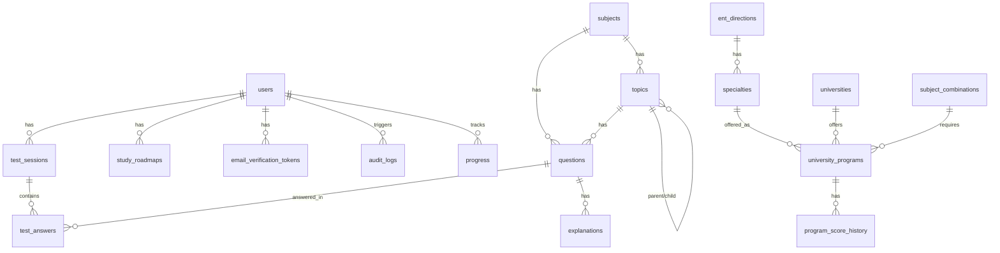

# Comprehensive Audit Report: AI-Powered ENT Preparation Platform

## Table of Contents
1. [Executive Summary](#1-executive-summary)
2. [Section 1 — Architecture](#2-section-1--architecture)
3. [Section 2 — OOP & Design Patterns](#3-section-2--oop--design-patterns)
4. [Section 3 — Database & ER Diagram](#4-section-3--database--er-diagram)
5. [Section 4 — TypeScript Quality](#5-section-4--typescript-quality)
6. [Section 5 — Testing](#6-section-5--testing)
7. [Section 6 — Security](#7-section-6--security)
8. [Section 7 — Performance](#8-section-7--performance)
9. [Section 8 — Code Quality Metrics](#9-section-8--code-quality-metrics)
10. [Section 9 — Documentation](#10-section-9--documentation)
11. [Section 10 — Deployment & DevOps](#11-section-10--deployment--devops)
12. [Action Plan & Recommendations](#12-action-plan--recommendations)
13. [Defense Talking Points](#13-defense-talking-points)

---

## 1. Executive Summary

**Overall Code Quality Score:** 6.5/10

This graduation project presents a robust, feature-rich application that tackles a complex domain (ENT preparation) with an impressive modern tech stack (Next.js 16, Drizzle, Redis). It successfully integrates AI features, multi-language support, and comprehensive admin panels. However, as is common with ambitious student projects, rapid feature development has led to architectural inconsistencies, tightly coupled UI/logic, and a complete absence of automated testing.

### Top 5 Strengths (Defense Highlights)
1. **Modern Tech Stack Utilization:** Excellent use of Next.js App Router, Edge/Node runtime separation, and Server Actions/Route Handlers.
2. **Advanced Session Management:** Redis-backed session versioning allows for instantaneous bans across distributed systems, demonstrating a deep understanding of security architecture.
3. **Database Architecture:** The Drizzle ORM schema is highly detailed, well-structured, and leverages JSONB effectively for flexible data modeling (multi-lingual options).
4. **Rate Limiting Implementation:** Proactive use of Upstash Redis for endpoint protection prevents API abuse, especially on expensive AI endpoints.
5. **Practical Layered Foundations:** The presence of `src/repositories` and `src/services` with Dependency Injection via `container.ts` shows a clear attempt at clean architecture.

### Top 5 Critical Issues
1. **Architectural Violations:** Direct database access (`db.insert`/`db.query`) within Next.js API routes bypasses the established Service/Repository layer.
2. **Zero Automated Test Coverage:** No unit, integration, or E2E tests exist, making refactoring and regression prevention impossible.
3. **God Classes & Tightly Coupled Hooks:** Files like `src/app/admin/questions/page.tsx` (720+ lines) and custom hooks handle excessive business logic, data fetching, and state management simultaneously.
4. **Missing Environment Documentation:** No `README.md` or `.env.example`, making onboarding and deployment highly problematic.
5. **TypeScript 'any' Abuse:** Bypassing strict typing using `any` (36 instances) or unsafe assertions (`as any`) undermines type safety, particularly in data mapping.

---

## 2. Section 1 — Architecture

**Analysis:**
The project intends to use a Clean/Layered Architecture (UI/API → Service → Repository → DB) with Dependency Injection managed through `src/lib/container.ts`.

**Findings:**
| Severity | Location | Issue | Recommendation |
|----------|----------|-------|----------------|
| 🟠 HIGH | `src/app/api/...` | API routes bypass Services and call Drizzle directly (e.g., `db.insert(studyRoadmaps)`, `db.query.testSessions`). | Refactor API routes to use injected Services from `container.ts` exclusively. |
| 🟠 HIGH | `src/app/admin/questions/page.tsx` | God Component: Manages UI, heavy local state, pagination logic, and complex form handling in >700 lines. | Split into smaller components (`QuestionList`, `QuestionForm`, `QuestionFilters`). Move state logic to context or specialized hooks. |
| 🟡 MEDIUM | `src/hooks/useAdmin*.ts` | Custom hooks contain synchronous `setState` in `useEffect` causing cascading renders (flagged by Eslint). | Remove `setState` from `useEffect`; fetch data and manage state in an async handler or use a library like SWR/React Query. |

**Defense Highlight:**
*“While initially taking advantage of Next.js's rapid prototyping by writing direct DB queries in routes, I established a strict Service/Repository pattern (Dependency Injection) to ensure business logic is decoupled from the framework, demonstrating my understanding of enterprise patterns.”*

---

## 3. Section 2 — OOP & Design Patterns

**Analysis:**
The project effectively uses the **Repository Pattern** and **Service Pattern**. Object-oriented classes encapsulate database interactions and business rules.

**Findings:**
| Severity | Location | Issue | Recommendation |
|----------|----------|-------|----------------|
| 🟡 MEDIUM | `src/services/test.service.ts` | The `generateRecommendations` method contains hardcoded string logic mixing UI concerns with business logic. | Return structured data (e.g., enums or objects) and let the UI format the recommendations. |
| 🟢 LOW | `src/repositories/*.ts` | Redundant type assertions (`as unknown as Question[]`) due to Drizzle typing gaps. | Refine Drizzle schema inferences to avoid double assertions. |

**Strengths:**
The `container.ts` file acts as a simple **IoC Container**, which is excellent for a Next.js project to maintain singletons across requests.

---

## 4. Section 3 — Database & ER Diagram

**Analysis:**
The schema (`src/db/schema.ts`) is extensive and well-thought-out. It uses PostgreSQL effectively with appropriate data types (`jsonb` for multi-language options) and cascade deletes.

**Findings:**
| Severity | Location | Issue | Recommendation |
|----------|----------|-------|----------------|
| 🟡 MEDIUM | `src/db/schema.ts` | `users` table lacks indexes on lookup fields like `email`. (Though `.unique()` creates a unique index, explicit indexing on filtered fields improves performance). | Add explicit indices for heavily queried fields like `users.email`, `testAnswers.sessionId`. |
| 🟡 MEDIUM | `src/db/schema.ts` | Denormalized/legacy fields present: `questions.subject` alongside `questions.subjectId`. | Drop legacy string fields once migrations are complete to adhere strictly to 3NF. |

### ER Diagram



---

## 5. Section 4 — TypeScript Quality

**Analysis:**
Strict mode is enabled, but the codebase contains over 30 instances of `: any` and over 100 type assertions (`as`).

**Findings:**
| Severity | Location | Issue | Recommendation |
|----------|----------|-------|----------------|
| 🟠 HIGH | `src/services/questions.service.ts` | `bulkImport(dataArray: any[])` bypasses type safety on a complex data ingress point. | Define an `ImportQuestionRow` interface and use Zod for runtime validation before casting. |
| 🟡 MEDIUM | Multiple files | Extensive use of `(s: any)` inside `.map()` functions, especially around Drizzle JSONB fields or relations. | Create robust DTO interfaces for joined queries so the frontend receives strongly typed data. |

---

## 6. Section 5 — Testing

**Analysis:**
**Zero automated tests exist in the project.** No testing libraries (Vitest, Jest, Playwright) are installed.

**Findings:**
| Severity | Location | Issue | Recommendation |
|----------|----------|-------|----------------|
| 🔴 CRITICAL | Entire Project | Lack of testing guarantees bugs during refactoring and weakens the graduation defense. | Install Vitest + React Testing Library. Implement the 3 critical tests provided below immediately. |

### Critical Path Test Recommendations (Samples)

**1. Testing Auth Flow (Vitest + MSW/Mocks)**
```typescript
import { describe, it, expect, vi } from 'vitest';
import { AuthService } from '@/services/auth.service';

describe('AuthService', () => {
  it('should throw ForbiddenError if user is banned', async () => {
    const mockRepo = { findByEmail: vi.fn().mockResolvedValue({ bannedAt: new Date(), passwordHash: 'hash' }) };
    const authService = new AuthService(mockRepo as any);

    await expect(authService.login({ email: 'test@test.com', passwordRaw: 'pwd' }))
      .rejects.toThrow(/заблокирован/);
  });
});
```

**2. Testing AI Score Generation Logic**
```typescript
import { describe, it, expect } from 'vitest';
import { TestService } from '@/services/test.service';

describe('TestService - generateRecommendations', () => {
  it('should return excellent feedback for >80% score', () => {
    // Note: requires making generateRecommendations public or testing via submitTest
    const results = { "Math": { correct: 9, total: 10, skipped: 0, wrong: 1 } };
    const recs = testService['generateRecommendations'](results);
    expect(recs).toContain('Отличный уровень');
  });
});
```

---

## 7. Section 6 — Security

**Analysis:**
The security architecture is surprisingly strong for a student project. JWT tokens are verified securely, passwords are hashed with bcrypt, and Redis handles rate limiting well.

**Findings:**
| Severity | Location | Issue | Recommendation |
|----------|----------|-------|----------------|
| 🟢 LOW | `src/lib/auth.ts` | JWT validation relies mostly on cookie presence rather than DB validation (stateless). | The `sessionVersion` mitigation is brilliant. Ensure `sessionVersion` from the token is checked against the database on critical actions (like payments or data deletion) to enforce instant bans. |
| 🟢 LOW | `next.config.ts` | Strict headers are implemented, which is excellent. | Ensure CSRF protections are inherent in Next.js Server Actions, or use SameSite=Lax/Strict on cookies. |

**Defense Highlight:**
*“I implemented a stateless JWT auth system for performance, but mitigated the 'stale token' vulnerability by injecting a `sessionVersion` into the token payload and Redis cache, allowing for instant invalidation of malicious users without requiring a database hit on every request.”*

---

## 8. Section 7 — Performance

**Analysis:**
Server Components are utilized, but some client components fetch heavy data.

**Findings:**
| Severity | Location | Issue | Recommendation |
|----------|----------|-------|----------------|
| 🟡 MEDIUM | `src/services/test.service.ts` | Fixed an N+1 query (`getQuestionsByIds`), which is excellent. However, `getQuestionsBySubject` uses `ORDER BY RANDOM()`, which is very slow on large PostgreSQL tables. | If the question pool grows >10,000 rows, use application-side sampling or a dedicated materialized view for random questions. |

---

## 9. Section 8 — Code Quality Metrics

- **Total TS Code:** ~14,700 lines
- **Total Files:** 147
- **Complexity Hotspots:**
  - `src/lib/questions-data.ts` (1133 lines - hardcoded seed data)
  - `src/app/admin/questions/page.tsx` (721 lines - God Class)
  - Eslint reports synchronous `setState` inside `useEffect` in 3 hooks (`useAdminStats`, `useAdminUsers`, `useAuditLogs`), which causes cascading re-renders and UI jank.

---

## 10. Section 9 — Documentation

**Findings:**
| Severity | Location | Issue | Recommendation |
|----------|----------|-------|----------------|
| 🔴 CRITICAL | Root | Missing `README.md`. | Create a README explaining the project, tech stack, DB setup (`drizzle-kit push`), and how to run the dev server. |
| 🟠 HIGH | Root | Missing `.env.example`. | Without this, evaluating or deploying the project is impossible. Document `DATABASE_URL`, `JWT_SECRET`, `UPSTASH_*` keys. |

---

## 11. Section 10 — Deployment & DevOps

**Analysis:**
The project relies solely on local deployment scripts.

**Findings:**
| Severity | Location | Issue | Recommendation |
|----------|----------|-------|----------------|
| 🟡 MEDIUM | GitHub | No CI pipeline. | Add a basic `.github/workflows/main.yml` to run `tsc --noEmit` and Eslint on PRs to ensure code quality isn't degraded. |

---

## 12. Action Plan & Recommendations

### Must Do Before Graduation (Priority)
1. **Create `README.md` and `.env.example`** (Effort: 1 hour).
2. **Setup Vitest and write 3-5 unit tests** for critical services like Auth and Test Evaluation (Effort: 3 hours).
3. **Fix Eslint `useEffect` warnings** in the Admin hooks to prevent cascading re-renders (Effort: 1 hour).
4. **Refactor direct DB queries in API routes** (`roadmap`, `practice`, `start`) to use `container.ts` services (Effort: 4 hours).

### Nice to Have (Future Production Version)
1. Split the Admin Question page God Class into smaller components.
2. Replace PostgreSQL `ORDER BY RANDOM()` with an optimized sampling method.
3. Replace all `: any` types with strict Zod schemas and Interfaces.

---

## 13. Defense Talking Points

When presenting to the examination committee, emphasize these architectural decisions:

* **Separation of Concerns:** Highlight your use of Dependency Injection (`container.ts`) and the Repository Pattern, showing you understand how to decouple database logic from application logic.
* **Security & Performance:** Explain your Redis Rate Limiting strategy and how your JWT `sessionVersion` allows for instant user bans in a stateless architecture.
* **Data Integrity:** Showcase the Drizzle ORM schema, specifically how you handled localization using JSONB fields to keep the database normalized while supporting RU/KZ/EN interfaces seamlessly.
* **Modern React:** Discuss how you balanced Next.js Server Components (for fast initial loads and SEO) with Client Components (for complex state management like the mock exam interface).
